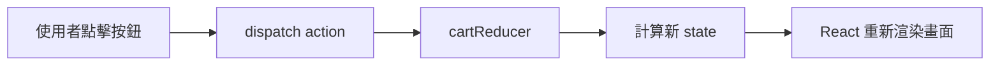

## useReducer 購物車程式詳細說明

### 整體架構

這個程式使用 `useReducer` Hook 管理購物車狀態，適合處理「多種操作影響同一個狀態物件」的情境。

---

### 1. 初始狀態 `initialState`

```js
const initialState = {
  items: [],   // 購物車中的商品陣列
  total: 0,    // 購物車總金額
};
```

---

### 2. Reducer 函式 `cartReducer(state, action)`

Reducer 是一個**純函式**，接收當前 state 和 action，回傳**新的 state**（不修改原 state）。

#### `ADD_ITEM` — 加入商品

```
dispatch({ type: 'ADD_ITEM', payload: { id, name, price } })
```

| 情況 | 邏輯 |
|---|---|
| 商品**已存在**購物車 | 用 `.map()` 找到該商品，將 `quantity + 1` |
| 商品**不存在**購物車 | 展開原陣列，新增 `{ ...payload, quantity: 1 }` |

兩種情況都會將 `action.payload.price` 加進 `total`。

#### `REMOVE_ITEM` — 移除商品

```
dispatch({ type: 'REMOVE_ITEM', payload: id })
```

- 先找出該商品（取得 `price` 和 `quantity`）
- 用 `.filter()` 將該 id 的商品從 `items` 移除
- `total` 減去 `item.price * item.quantity`（整筆移除）

#### `CLEAR_CART` — 清空購物車

```
dispatch({ type: 'CLEAR_CART' })
```

- 直接回傳 `initialState`，重置為初始空狀態

#### `default`

- 未知 action 型別時，回傳原 state，避免狀態消失

---

### 3. 元件 `ShoppingCart`

```js
const [cart, dispatch] = useReducer(cartReducer, initialState);
```

| 變數 | 說明 |
|---|---|
| `cart` | 當前狀態（`{ items, total }`） |
| `dispatch` | 觸發 action 的函式 |

**輔助函式：**
- `addItem(product)` → 包裝 `dispatch`，發送 `ADD_ITEM`
- `removeItem(id)` → 包裝 `dispatch`，發送 `REMOVE_ITEM`

---

### 4. 畫面渲染邏輯

```
購物車（N 項）
  └─ 每個 item：名稱 x 數量 — 小計  [移除按鈕]
總計：$xxx
[清空購物車按鈕]
────────────────
商品列表
  └─ iPhone $999  [加入購物車]
  └─ AirPods $249 [加入購物車]
```

---

### 5. 資料流圖



---

### 為何用 `useReducer` 而非 `useState`？

| | `useState` | `useReducer` |
|---|---|---|
| 適合 | 單一、簡單的值 | 多欄位、多種操作的複雜狀態 |
| 邏輯位置 | 分散在各 handler | **集中在 reducer** |
| 可測試性 | 較難單獨測試 | reducer 是純函式，易單元測試 |

此購物車同時管理 `items` 陣列和 `total` 數字，且有 ADD/REMOVE/CLEAR 三種操作，正是 `useReducer` 的理想使用場景。

---

## dispatch 詳細說明

### dispatch 是什麼？

`dispatch` 是 `useReducer` 回傳的**觸發函式**，用來通知 React「我要執行某個操作」。
呼叫 `dispatch` 後，React 會把當前 state 和你傳入的 action 交給 reducer 函式計算新 state，再觸發重新渲染。

```js
const [cart, dispatch] = useReducer(cartReducer, initialState);
//              ↑
//        這就是 dispatch
```

---

### action 物件結構

`dispatch` 接收一個 **action 物件**，慣例上包含兩個欄位：

| 欄位 | 必填 | 說明 |
|---|---|---|
| `type` | ✅ | 字串，描述要做什麼操作（慣例用大寫加底線） |
| `payload` | ❌ | 附帶的資料，可以是任何型別 |

```js
dispatch({
  type: 'ADD_ITEM',       // 操作類型
  payload: { id: 1, name: 'iPhone', price: 999 }  // 附帶資料
});
```

---

### 三種 dispatch 呼叫方式比較

#### 方式一：直接在 JSX 內呼叫
```jsx
<button onClick={() => dispatch({ type: 'CLEAR_CART' })}>
  清空購物車
</button>
```
適合邏輯簡單、不需要傳遞額外資料的操作。

#### 方式二：包裝成輔助函式（本範例做法）
```js
const addItem = (product) => {
  dispatch({ type: 'ADD_ITEM', payload: product });
};

// JSX 中使用
<button onClick={() => addItem(product)}>加入購物車</button>
```
優點：JSX 更簡潔，可在 dispatch 前加入驗證邏輯。

#### 方式三：搭配 `useCallback` 避免不必要重建
```js
const removeItem = useCallback((id) => {
  dispatch({ type: 'REMOVE_ITEM', payload: id });
}, []); // dispatch 本身是穩定參考，依賴陣列可為空
```
適合將函式傳給子元件時使用，避免子元件不必要的重新渲染。

---

### dispatch 的執行流程

```
dispatch({ type: 'ADD_ITEM', payload: product })
         │
         ▼
  cartReducer(currentState, action)
         │
         ▼
  switch(action.type)  →  case 'ADD_ITEM'
         │
         ▼
  回傳新的 state 物件
         │
         ▼
  React 更新 cart 變數並重新渲染元件
```

---

### 重要特性

#### 1. dispatch 是穩定參考
`dispatch` 函式在元件生命週期中**不會改變**，可以安全地放入 `useEffect` 的依賴陣列，或傳遞給子元件，不會造成無限迴圈。

```js
useEffect(() => {
  // 可以安全使用 dispatch，不需要加入依賴陣列
  dispatch({ type: 'CLEAR_CART' });
}, []); // ✅ 不需要把 dispatch 列入依賴
```

#### 2. dispatch 是非同步的
呼叫 `dispatch` 後，state **不會立即更新**，React 會在下一次渲染時才反映新 state。

```js
const addItem = (product) => {
  dispatch({ type: 'ADD_ITEM', payload: product });
  console.log(cart.items); // ❌ 這裡印出的還是舊的 state！
};
```

#### 3. 連續呼叫多個 dispatch
React 會**批次處理（batch）**同一個事件中的多個 dispatch，最終只觸發一次重新渲染。

```js
const addMultiple = () => {
  dispatch({ type: 'ADD_ITEM', payload: iPhone });
  dispatch({ type: 'ADD_ITEM', payload: AirPods });
  // React 批次處理，只重新渲染一次 ✅
};
```

---

### 與 useState 的 setter 比較

| | `useState` 的 setter | `dispatch` |
|---|---|---|
| 呼叫方式 | `setCount(newValue)` | `dispatch({ type, payload })` |
| 邏輯位置 | 寫在呼叫處 | 集中在 reducer |
| 適合情境 | 簡單單一值 | 複雜多欄位狀態 |
| 穩定參考 | ✅ | ✅ |
| 非同步更新 | ✅ | ✅ |