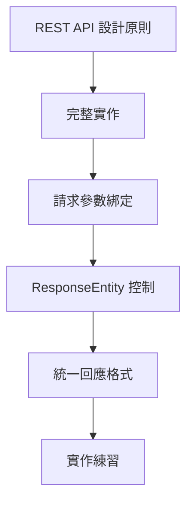

# Spring Boot Day 03 優化修改意見

## 文件結構優化

### 1. 增加學習路徑圖
建議在文件開頭加入一個簡單的學習路徑圖，幫助學習者了解整體學習流程。

### 2. 增加常見問題區塊
在每個主要章節後加入「常見問題」區塊，幫助學習者排除疑難。

### 3. 增加難度標示
在每個章節和練習前加入難度標示（⭐~⭐⭐⭐），幫助學習者分配時間。

## 內容優化建議

### 1. REST API 設計原則部分
- **增加 RESTful 設計原則**：介紹資源命名、HTTP 方法選擇等最佳實踐
- **增加 API 版本控制說明**：如何進行 API 版本管理
- **增加 API 文檔重要性說明**：為什麼需要 API 文檔

### 2. 完整實作部分
- **增加 Service 層分離**：將商業邏輯從 Controller 中分離
- **增加 Repository 層抽象**：將資料存取邏輯分離
- **增加例外處理機制**：統一處理例外狀況

### 3. 請求參數綁定部分
- **增加參數驗證說明**：如何使用 Bean Validation 驗證參數
- **增加自訂參數轉換器**：如何處理複雜的參數轉換
- **增加參數預設值進階用法**：更靈活的參數預設值設定

### 4. ResponseEntity 控制部分
- **增加更多 HTTP 狀態碼說明**：介紹常見的 HTTP 狀態碼使用場景
- **增加回應標頭設定**：如何設定自訂回應標頭
- **增加回應內容格式化**：如何格式化回應內容

### 5. 統一回應格式部分
- **增加分頁回應格式**：如何設計分頁回應
- **增加錯誤回應格式**：如何設計錯誤回應
- **增加回應加密說明**：敏感資料的回應處理

## 新增章節建議

### 1. API 錯誤處理
介紹統一的錯誤處理機制和錯誤回應格式。

### 2. API 安全性
介紹 API 安全性的基本概念和實作方式。

### 3. API 測試
介紹如何為 REST API 編寫單元測試和整合測試。

### 4. API 效能優化
介紹 API 效能優化的基本技巧。

### 5. API 監控與日誌
介紹 API 監控和日誌記錄的重要性。

## 程式碼優化建議

### 1. 增加完整範例
在每個章節提供完整的、可運行的範例程式碼。

### 2. 增加錯誤範例
展示常見的錯誤用法和正確的修正方法。

### 3. 增加測試範例
為每個範例提供對應的單元測試。

### 4. 增加註解說明
在程式碼中加入更詳細的註解，解釋每個關鍵步驟。

## 學習效果評估

### 1. 增加自我評量表
在文件末尾加入自我評量表，讓學習者評估學習效果。

### 2. 增加延伸閱讀
提供相關的學習資源連結。

### 3. 增加下一步指引
說明 Day 04 的學習內容和準備工作。

## 實作練習文件結構

建議創建一個獨立的實作練習文件，包含：

1. **基礎練習**：REST API 基礎實作
2. **進階練習**：參數綁定和回應控制
3. **實戰練習**：完整的 CRUD 操作
4. **除錯練習**：解決常見問題

這些優化建議可以幫助學習者更全面地理解 Spring MVC 和 REST API 的知識，並提供足夠的實作機會來鞏固學習成果。