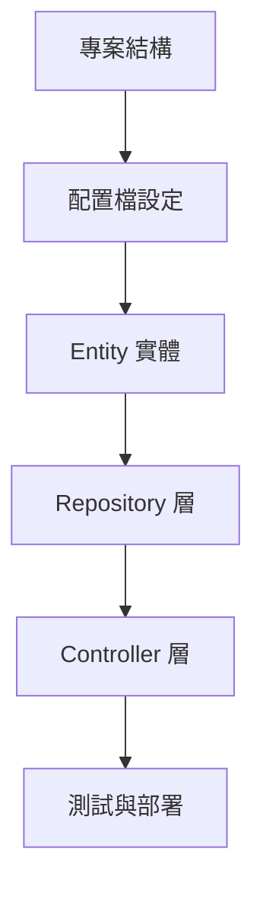

# Spring Boot Day 05 優化修改意見

## 文件結構優化

### 1. 增加學習路徑圖
建議在文件開頭加入一個簡單的學習路徑圖，幫助學習者了解整體學習流程。

### 2. 增加常見問題區塊
在每個主要章節後加入「常見問題」區塊，幫助學習者排除疑難。

### 3. 增加難度標示
在每個章節和練習前加入難度標示（⭐~⭐⭐⭐），幫助學習者分配時間。

## 內容優化建議

### 1. 專案結構部分
- **增加分層架構說明**：詳細解釋 Controller、Service、Repository 各層的職責
- **增加套件結構最佳實踐**：介紹不同的套件組織方式
- **增加配置檔的完整說明**：詳細解釋每個配置項的作用

### 2. Entity 實體部分
- **增加 JPA 註解詳細說明**：@Entity、@Table、@Column、@Id、@GeneratedValue 等
- **增加關聯映射說明**：一對一、一對多、多對多的實作
- **增加 Entity 驗證**：如何使用 Bean Validation 驗證 Entity

### 3. Repository 層部分
- **增加自訂查詢方法**：如何使用 @Query 實作自訂查詢
- **增加分頁和排序**：如何使用 Pageable 和 Sort
- **增加 Repository 測試**：如何測試 Repository 層

### 4. Controller 層部分
- **增加例外處理**：如何統一處理例外狀況
- **增加參數驗證**：如何驗證請求參數
- **增加 API 文檔**：如何整合 Swagger

### 5. 測試資料部分
- **增加測試資料管理**：如何管理不同環境的測試資料
- **增加資料初始化策略**：如何選擇合適的資料初始化方式
- **增加測試資料清理**：如何在測試後清理資料

## 新增章節建議

### 1. Service 層實作
介紹如何建立 Service 層，將商業邏輯從 Controller 中分離。

### 2. 例外處理機制
介紹如何建立統一的例外處理機制。

### 3. API 文檔整合
介紹如何整合 Swagger/OpenAPI 來產生 API 文檔。

### 4. 單元測試
介紹如何為各層編寫單元測試。

### 5. 整合測試
介紹如何編寫整合測試，測試完整的 API 流程。

## 程式碼優化建議

### 1. 增加完整範例
在每個章節提供完整的、可運行的範例程式碼。

### 2. 增加錯誤範例
展示常見的錯誤用法和正確的修正方法。

### 3. 增加測試範例
為每個範例提供對應的單元測試。

### 4. 增加註解說明
在程式碼中加入更詳細的註解，解釋每個關鍵步驟。

## 學習效果評估

### 1. 增加自我評量表
在文件末尾加入自我評量表，讓學習者評估學習效果。

### 2. 增加延伸閱讀
提供相關的學習資源連結。

### 3. 增加下一步指引
說明 Day 06 的學習內容和準備工作。

## 實作練習文件結構

建議創建一個獨立的實作練習文件，包含：

1. **基礎練習**：基本的 CRUD 操作
2. **進階練習**：分頁、搜尋、排序
3. **實戰練習**：完整的 Employee 管理系統
4. **除錯練習**：解決常見問題

這些優化建議可以幫助學習者更全面地理解 Spring Boot 的資料庫整合知識，並提供足夠的實作機會來鞏固學習成果。